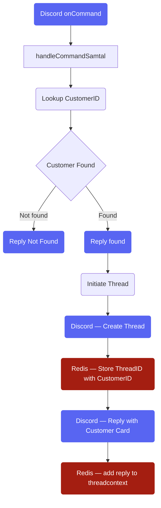
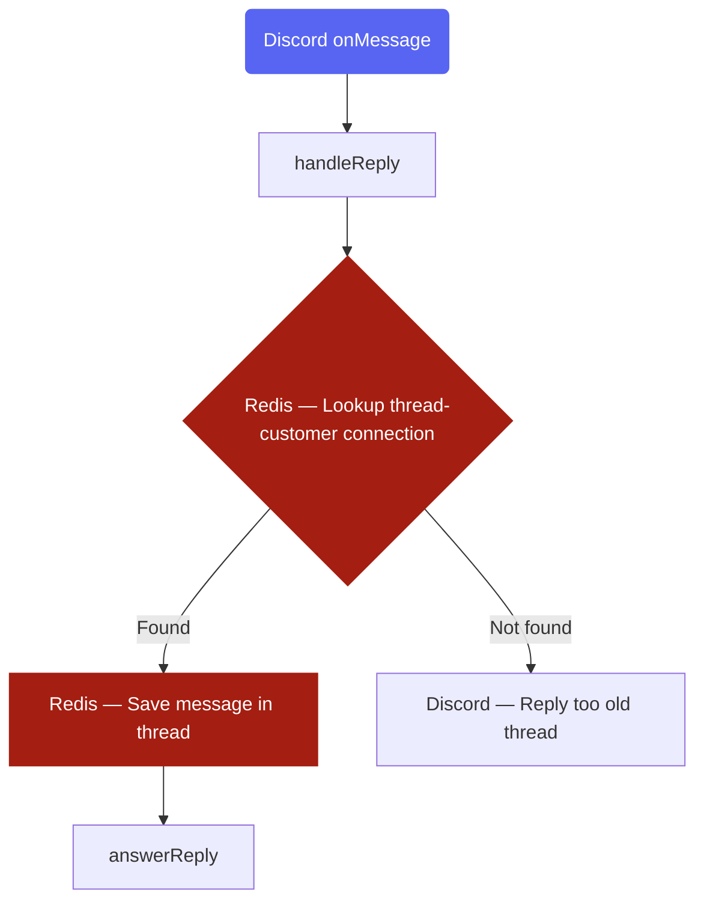
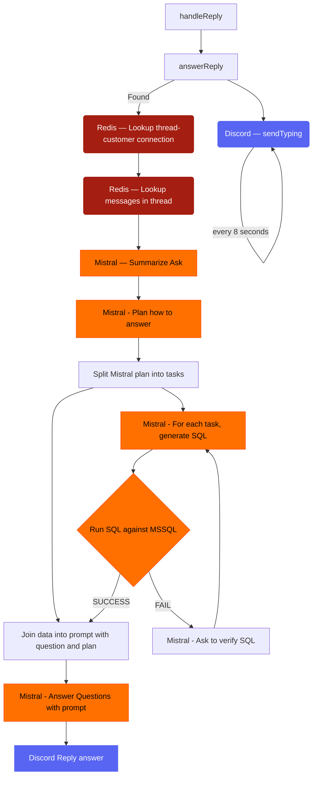

# NVAA AI colleague

## Data Flow

Some of the following steps will be performed in parallel and most will be asynchronous. If a process is failed it's important to be able to restart it after a new code release so we can iterate on the prompts etc without having to restart the whole process again.

### onCommand flow

### onMessage flow

### AI overarching flow

## New workflow
1. Find customer based on phone number (workers/handleCall.ts)
2. Reply with customer information (workers/handleReply.ts)

## Get Started

Get an OPENAI_API_KEY from OpenAI and add it to a .env file in the root directory. Run redis locally or add REDIS_HOST and REDIS_PORT into the .env file.

    nvm use # or some other node version manager
    npm i
    docker compose up -d &
    npm run dev

NOTE: To add a new job to the queue manually you can uncomment the lines in index.ts to create a new downloadPDF job.

## Environment/Secrets

Create a .env file in the root lib and add these tokens/secrets before running the application:

    MISTRAL_API_KEY=
    DISCORD_APPLICATION_ID=
    DISCORD_TOKEN=
    DISCORD_SERVER_ID=
    DISCORD_CHANNEL_ID=
    REDIS_HOST=
    REDIS_PORT=
    # REDIS_PASSWORD=

## Next steps / Tasks

## Operations

This application is run in Kubernetes and uses FluxCD as CD pipeline. To create secret in the k8s cluster - use this command to transfer your .env file as secret to the application

    kubectl create secret generic env --from-env-file=.env

## License

MIT
